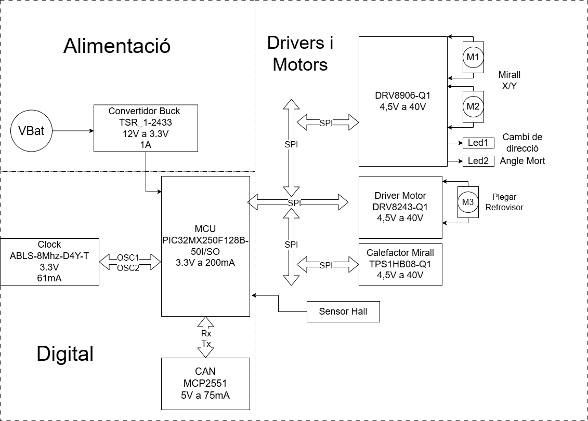

View this project on [CADLAB.io](https://cadlab.io/project/30190). 

# Projecte Retrovisors

>**Autors:Carlos Soler Fernandez, Ingrid ** 
>**Versió: 1.01**

----------

## Objectiu

>Poder obrir y tancar els retrovisors del cotxe
>Crear els leds de canvi de dirección i angle mort 
>Crear un defoger
>Poder ajustar els retrovisors del cotxe

## Diagrama de blocs

### Descripció/funcionalitat de cada bloc

  *

-----------

## Requisits / Especificacions

  * Alimentació; 12V, regulada 5V
  * Microcontrolador PIC18xxxxxxxxx
  * ...

-----------

## Components

| Descripci&#243; | Ref | Package |Datasheet | Prove&#239;dor | Preu | Unitats |
| --- | --- | --- | --- | ---| --- | --- |
| Microcontrolador | PIC18F26Q83-I/SS | SOIC-28 |[Datasheet](https://www.mouser.es/datasheet/2/268/PIC18F27_47_57Q83_Preliminary_Data_Sheet_40002265B-2887591.pdf) | [Mouser](https://www.mouser.es/c/?q=PIC18F27Q83-I%2FSO)| 2,17&euro;| 1x |
| XTAL-Ressonador | CSTCR7M99G53-R0 | SMD |[Datasheet](https://www.mouser.es/datasheet/2/281/p16e-522700.pdf) | [Mouser](https://www.mouser.es/ProductDetail/Murata-Electronics/CSTCR7M99G53-R0?qs=Zd9RUO93%2Fo7cnwzsujIkpA%3D%3D)  | 0,27&euro; | 1x |

-----------

## Software

### Eines:

  * KiCad 9.0 o superior
  * 

### Configuraci&#243; :

  * 

### Funcionalitats:

  * 

-----------

## Historial de canvis

| Data | Autor     | Branch | Versi&#243; | Descripci&#243; |
| --- | --- | --- | --- | --- |
|  28/03/2023 | mlopez | Master | initial commit | Primera versi&#243; d'esquem&#224;tic i selecci&#243; de components |Aquí tienes la lista con los commits formateados exactamente como pides, para que puedas pegarlos directamente en tu programa:

| 11/03/2026 | iingridlopez | Master | prova | Inici del projecte |
| 17/03/2026 | canals-ub | Master | Backlink added | Backlink to CADLAB.io has been added. |
| 17/03/2026 | Carlosolerfernandez | Master | Create project kicad | Inici del projecte en KiCad |
| 17/03/2026 | Carlosolerfernandez | Master | Inici kiCat | Primera versió de l'esquemàtic |
| 17/03/2026 | Carlosolerfernandez | Master | Inici proyecta kicat | Configuració de fitxers inicials |
| 17/03/2026 | Carlosolerfernandez | Master | Etapa de alimentació 1 | Disseny de la primera part d'alimentació |
| 17/03/2026 | Carlosolerfernandez | Master | Etapa de alimentacio completa | Finalització de l'etapa d'alimentació |
| 17/03/2026 | Carlosolerfernandez | Master | Alimentacio finalitzada e inici de micro | Transició al disseny del microcontrolador |
| 18/03/2026 | Carlosolerfernandez | Master | microcontrolador i driver | Afegit microcontrolador i perifèrics |
| 22/03/2026 | Carlosolerfernandez | Master | Correcio gnd, proposicio canvi de micro | Correcció de masses i revisió de components |
| 23/03/2026 | Carlosolerfernandez | Master | Reorganització proyecte, inici conexions CAN | Gestió del bus CAN |
| 23/03/2026 | Carlosolerfernandez | Master | Part Micro quasi completat | Falta afegir etiquetes de potencia |
| 24/03/2026 | Carlosolerfernandez | Master | Microprocessador finalissim | Placement de alimentacion y micro |
| 25/03/2026 | Carlosolerfernandez | Master | Diagrama de Blocs Afegit | Canvi del swicht1 to push botton5 |
| 29/03/2026 | iingridlopez | Branca Nova | Creacio de branca nova i update | Inici de nova branca de treball |
| 07/04/2026 | iingridlopez | Master | actualització (NO VERSIÓ FINAL) | Sincronització de canvis |
| 08/04/2026 | iingridlopez | Master | esquematic + placement | Falta routing dels drivers |
| 08/04/2026 | Carlosolerfernandez | Master | README | Creació del fitxer de documentació |
| 08/04/2026 | iingridlopez | Master | añadido el readme | Actualització de documentació |
| 08/04/2026 | Carlosolerfernandez | Master | Modificació placement | Ajustos en la placa |
| 08/04/2026 | iingridlopez | Master | prueba para unir a la main | Test de merge |
| 08/04/2026 | iingridlopez | Master | Merge con resolución de conflictos | Unió de branques en KiCad |
| 08/04/2026 | Carlosolerfernandez | Master | afegim diagrama | Actualització gràfica del projecte |
| 08/04/2026 | Carlosolerfernandez | Master | Correccion Readme | Revisió de textos |
| 08/04/2026 | Carlosolerfernandez | Master | eliminamos GND PWR | Modificació de tots els GND |
| 10/04/2026 | iingridlopez | Master | millora de placement | Optimització d'espai |
| 13/04/2026 | Carlosolerfernandez | Master | Enrotament Part digital finalitzada | Finalització del routing digital |

